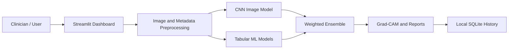

# Architecture

```mermaid
flowchart LR
  User[Clinician / User] --> UI[Streamlit Dashboard]
  UI --> Preprocess[Image and Metadata Preprocessing]
  Preprocess --> CNN[CNN Image Model]
  Preprocess --> ML[Tabular ML Models]
  CNN --> Ensemble[Weighted Ensemble]
  ML --> Ensemble
  Ensemble --> Explain[Grad-CAM and Reports]
  Explain --> History[Local SQLite History]
```

